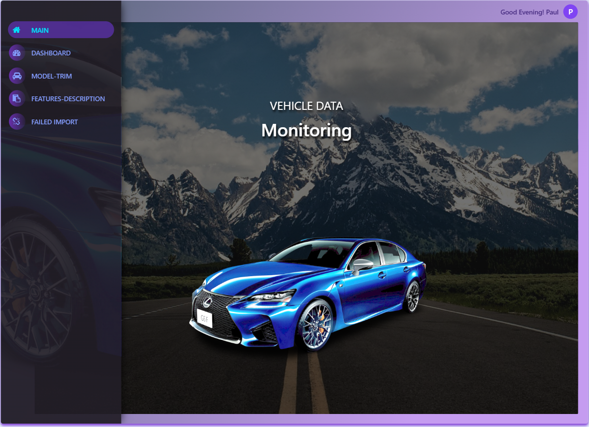
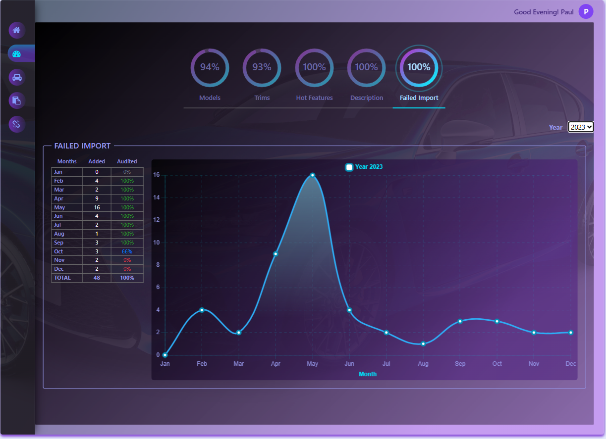
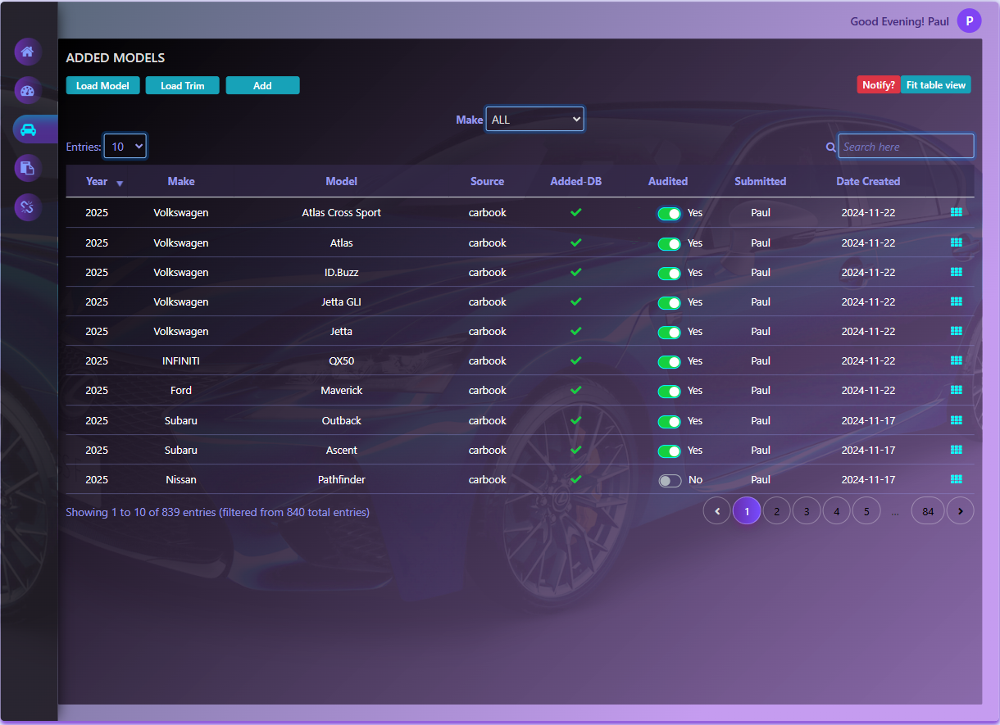
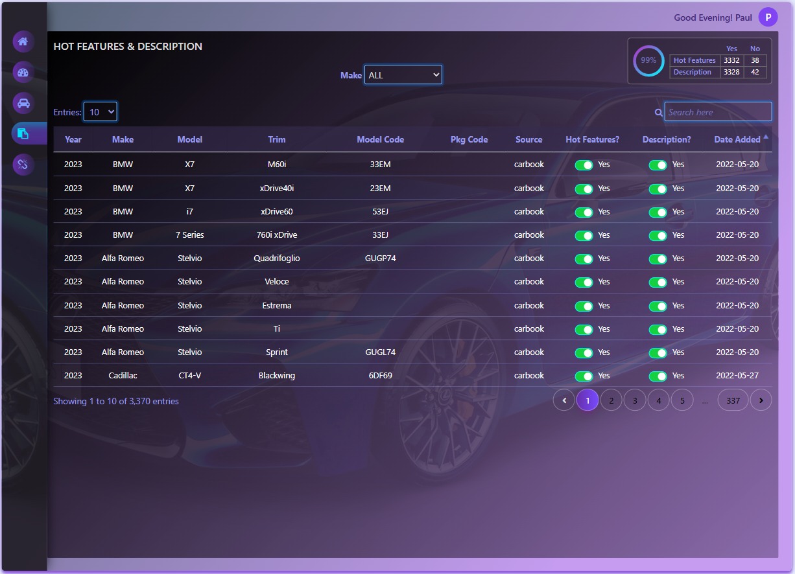

# Vehicle Data Monitoring (VDM)

**VDM** is a **Google Apps Script** web app that monitors and manages vehicle model and trim data in **Google Sheets**. Built as a portfolio piece to show serverless CRUD, templated HTML, and spreadsheet-backed dashboards without a traditional backend.

## Live demo

**URL:** [Open the web app](https://script.google.com/macros/s/AKfycbwsvDezT1ZB9RGJqlueIUG_I0K_aFXda0mfVy01lknpqLUzr0PhB0T8xk2oWWO8Gz_qow/exec)

**Demo login** (for the hosted deployment above; same values as on the portfolio project card):

| Field | Value |
|--------|--------|
| Username | `testuser` |
| Password | `testing123` |

These credentials are only for the hosted demo viewer experience; rotate or disable them if you retire the deployment.

## Screenshots

All previews use the same display width (native aspect ratios differ).

| Main shell | Dashboard |
|------------|-----------|
|  |  |

| Model / trim | Features & description |
|--------------|------------------------|
|  |  |

## Highlights

- **Web app shell** with sidebar navigation: home, dashboard, model/trim editing, feature descriptions, and failed-import review.
- **Spreadsheet CRUD** — reads and writes rows per vehicle make (sheet-per-make pattern); ID generation for models and trims.
- **Dashboard** — Chart.js visualizations over sheet data (see `dashboard-view-js.html`, `dashboard-chart-js.html`).
- **Auth flow** — token-based session checks against a `login` sheet; routes for login, logout, password reset, and session expiry (`router.js`).
- **UI** — Bootstrap 4, DataTables, Font Awesome; HTML split into views and `include()` partials for styles and client scripts.

## Tech stack

| Area | Choice |
|------|--------|
| Runtime | Google Apps Script (V8) |
| UI | HtmlService templates, Bootstrap 4, jQuery, DataTables, Chart.js |
| Data | Google Sheets (bound spreadsheet) |
| Local workflow | [clasp](https://github.com/google/clasp) (`appsscript.json`; `.clasp.json` is gitignored — create with `clasp clone` or your script ID) |

## Repository layout

- **`*.js`** — server-side script files (Apps Script). Entry routing: `router.js` (`doGet`). Data layer: `crud.js`, `tabData.js`, etc.
- **`*-view.html`** — full page templates served by `doGet` or loaded into the main shell.
- **`*-js.html` / `*-style.html`** — fragments included in templates via `include('filename-without-extension')`.
- **`appsscript.json`** — project metadata (timezone, web app execution mode, logging).

## Running and deploying

1. Install [Node.js](https://nodejs.org/) and clasp: `npm i -g @google/clasp`.
2. `clasp login`, then link this folder to your Apps Script project (`clasp clone <scriptId>` generates `.clasp.json`, which is not committed).
3. Bind the script to a spreadsheet that includes the sheets your code expects (including **`login`** for tokens and per-make sheets used by `crud.js`).
4. `clasp push` to upload sources; in the Apps Script editor, **Deploy → New deployment → Web app** and grant access as needed.

> **Note:** This repo is for showcase. A production app would use stronger auth, least-privilege deployment, and careful handling of secrets. Do not commit API keys or OAuth client secrets.

## License

This project is provided as sample portfolio code. Add a license file if you want to specify terms for reuse.
# vdm
